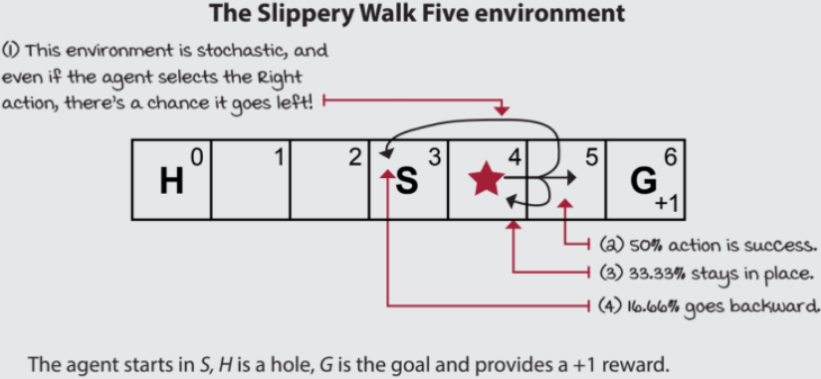

# POLICY EVALUATION

## AIM:
To develop a Python program to evaluate the given policy.

## PROBLEM STATEMENT:
The bandit slippery walk problem is a reinforcement learning problem in which an agent must learn to navigate a 7-state environment in order to reach a goal state. The environment is slippery, so the agent has a chance of moving in the opposite direction of the action it takes.

### STATES:
The environment has 7 states:

Two Terminal States: G: The goal state & H: A hole state.

Five Transition states / Non-terminal States including S: The starting state.

### ACTIONS:
The agent can take two actions:

R: Move right.

L: Move left.

### TRANSITION PROBABILITIES:
The transition probabilities for each action are as follows:

50% chance that the agent moves in the intended direction.

33.33% chance that the agent stays in its current state.

16.66% chance that the agent moves in the opposite direction.

For example, if the agent is in state S and takes the "R" action, then there is a 50% chance that it will move to state 4, a 33.33% chance that it will stay in state S, and a 16.66% chance that it will move to state 2.

### REWARDS:
The agent receives a reward of +1 for reaching the goal state (G). The agent receives a reward of 0 for all other states.

## GRAPHICAL REPRESENTATION:


## POLICY EVALUATION FUNCTION:


## PROGRAM:
```
Developed by : Paarkavy B
Reg No : 212221230072
```

```
def policy_evaluation(pi, P, gamma=1.0, theta=1e-10):
   	'''Initialize 1st Iteration estimates of state-value function(V) to zero'''
    prev_V = np.zeros(len(P), dtype=np.float64)

    while True:
        '''Initialize the current iteration estimates to zero'''
        V=np.zeros(len(P),dtype=np.float64)
        
        for s in range(len(P)):
        
            '''Update the value function for each state'''
            for prob,next_state,reward,done in P[s][pi(s)]:
                V[s] += prob * (reward + gamma * prev_V[next_state] * (not done))
                
            '''Check for convergence'''
            if np.max(np.abs(prev_V-V))<theta:
                break
                
            '''Update the previous state-value function'''
            prev_V=V.copy()
        return V
```

## OUTPUT:
### POLICY 1:


### POLICY 2:


### COMPARISON:


### CONCLUSION:


## RESULT:
Thus, a Python program is developed to evaluate the given policy.
